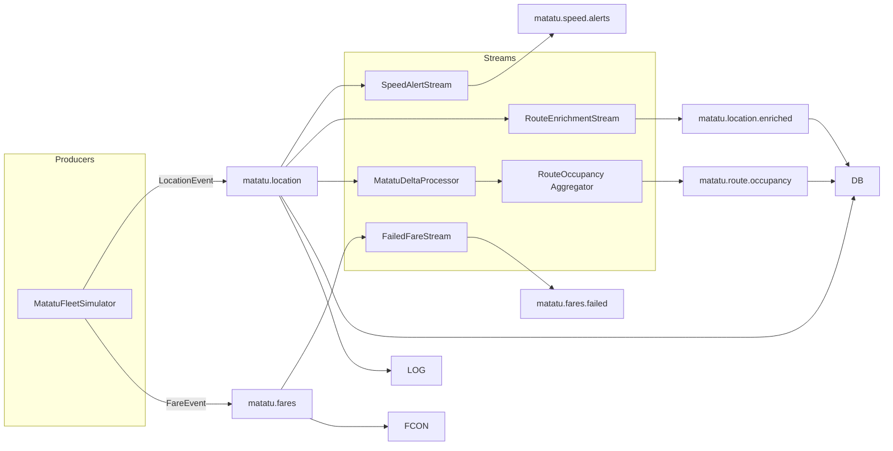
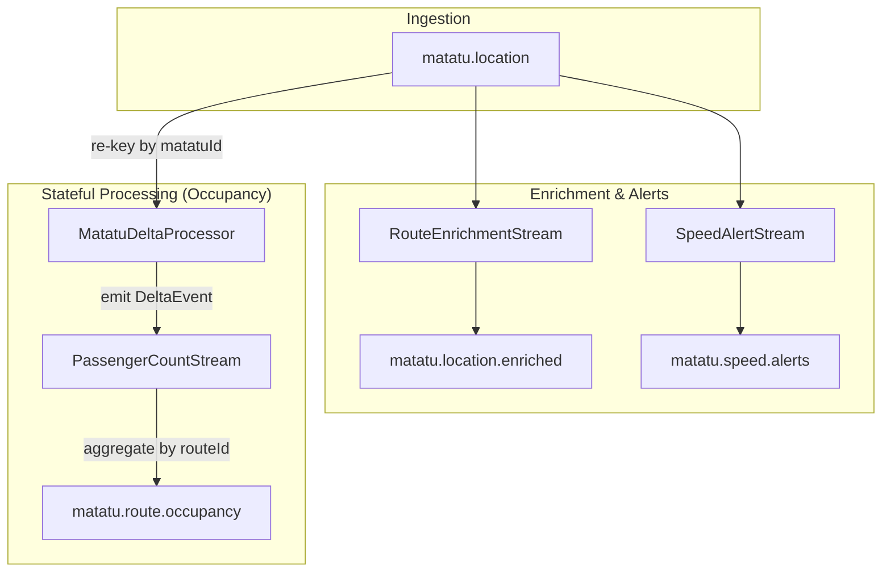
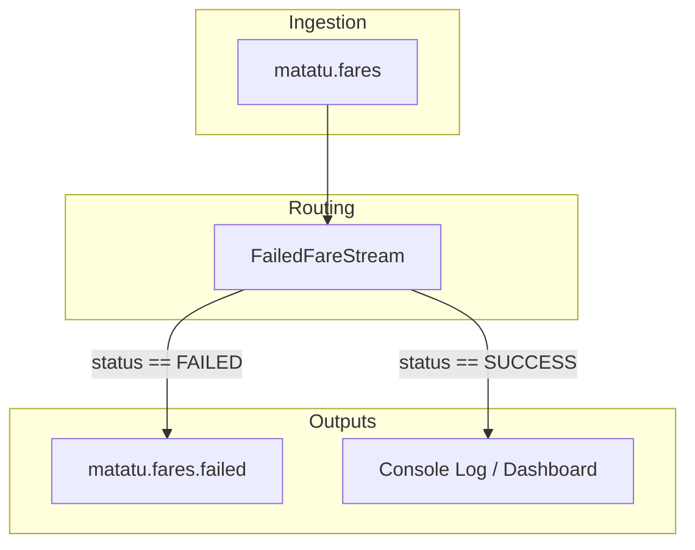

**Data Models & Kafka Pipelines**

- **Purpose**: This document describes the application's data models (Java records), JSON representations, and how messages are produced, processed, and consumed through Kafka topologies.

**Topics**:
- **MATATU_LOCATION**: `matatu.location` — raw GPS pings (key = `routeId`). See [src/main/java/org/matatu/tracker/topics/Topics.java](src/main/java/org/matatu/tracker/topics/Topics.java#L1-L20).
- **MATATU_FARES**: `matatu.fares` — fare payment events (key = `matatuId`).
- **MATATU_SPEED_ALERTS**: `matatu.speed.alerts` — speed alerts emitted by the speed stream.
- **MATATU_LOCATION_ENRICHED**: `matatu.location.enriched` — enriched location events with SACCO info.
- **MATATU_FARES_FAILED**: `matatu.fares.failed` — failed fare events branched out from fares.
- **MATATU_PASSENGER_COUNTS**: `matatu.passenger.counts` — (not used directly in current streams; passenger/occupancy output is `matatu.route.occupancy`).
- **MATATU_SACCO_REVENUE**: `matatu.sacco.revenue` — revenue per sacco (windowed aggregation).
- **MATATU_OFFGRID_ALERTS**: `matatu.offgrid.alerts` — alerts when a vehicle stops reporting.
- **MATATU_ROUTE_OCCUPANCY**: `matatu.route.occupancy` — aggregated, real-time route occupancy.

**Model JSON representations**

1) `LocationEvent` (src: [src/main/java/org/matatu/tracker/model/LocationEvent.java](src/main/java/org/matatu/tracker/model/LocationEvent.java#L1-L60))

Example JSON:
```json
{
	"matatuId": "KBZ 123A",
	"routeId": "route_33",
	"routeName": "Route 33",
	"latitude": -1.2921,
	"longitude": 36.8219,
	"speedKmh": 45.5,
	"passengersOnboard": 12,
	"timestamp": "2026-02-23T10:15:30Z"
}
```

Fields:
- `matatuId`: string
- `routeId`: string (used as Kafka message key to ensure per-route ordering)
- `routeName`: string
- `latitude`, `longitude`: number
- `speedKmh`: number
- `passengersOnboard`: integer
- `timestamp`: ISO-8601 string

2) `FareEvent` (src: [src/main/java/org/matatu/tracker/model/FareEvent.java](src/main/java/org/matatu/tracker/model/FareEvent.java#L1-L60))

Example JSON:
```json
{
	"transactionId": "TXN-1001",
	"matatuId": "KBZ 123A",
	"passengerId": "PAX-12",
	"amountKes": 100,
	"paymentMethod": "MPESA",
	"status": "SUCCESS",
	"timestamp": "2026-02-23T10:15:31Z"
}
```

Fields:
- `transactionId`: string
- `matatuId`: string (Kafka key)
- `passengerId`: string
- `amountKes`: number (decimal)
- `paymentMethod`: enum {MPESA, CASH, CARD}
- `status`: enum {SUCCESS, FAILED, PENDING}
- `timestamp`: ISO-8601 string

3) `EnrichedLocationEvent` (output of enrichment stream)

Example JSON:
```json
{
	"matatuId": "KBZ 123A",
	"routeId": "route_33",
	"routeName": "Route 33",
	"saccoName": "Citi Hoppa",
	"saccoId": "sacco_01",
	"terminus": "Kikuyu Town",
	"latitude": -1.2921,
	"longitude": 36.8219,
	"speedKmh": 45.5,
	"passengersOnboard": 12,
	"isSpeeding": false,
	"originalTimestamp": "2026-02-23T10:15:30Z",
	"enrichedAt": "2026-02-23T10:15:30.100Z"
}
```

4) `DeltaEvent` (internal between processor -> aggregator)

Example JSON (internal):
```json
{
	"matatuId": "KBZ 123A",
	"routeId": "route_33",
	"routeName": "Route 33",
	"passengerDelta": 2,
	"boardings": 2,
	"alightings": 0
}
```

Note: `DeltaEvent` is produced by `MatatuDeltaProcessor` and forwarded inside the stream; it is not published to an external topic by the processor itself.

5) `MatatuSnapshot` (state store value — not sent externally)

6) `OffGridAlert` (punctuator-driven alert)

Example JSON:
```json
{
	"matatuId": "KBZ 123A",
	"routeId": "route_33",
	"routeName": "Route 33",
	"lastKnownLatitude": -1.2921,
	"lastKnownLongitude": 36.8219,
	"silenceDurationMs": 360000,
	"lastSeenAt": "2026-02-23T10:10:30Z",
	"alertRaisedAt": "2026-02-23T10:15:30Z"
}
```

7) `RouteOccupancy` (published to `matatu.route.occupancy`)

Example JSON:
```json
{
	"routeId": "route_33",
	"routeName": "Route 33",
	"currentPassengers": 128,
	"totalBoardings": 4520,
	"totalAlightings": 4392,
	"lastUpdated": "2026-02-23T10:15:31Z"
}
```

8) `SaccoRevenueWindow` (windowed aggregation output -> `matatu.sacco.revenue`)

Example JSON:
```json
{
	"saccoId": "sacco_01",
	"saccoName": "Citi Hoppa",
	"totalRevenueKes": 12345.00,
	"transactionCount": 142,
	"windowStart": "2026-02-23T09:00:00Z",
	"windowEnd": "2026-02-23T10:00:00Z",
	"computedAt": "2026-02-23T10:00:00.050Z"
}
```

**How data flows through Kafka topologies (high-level)**

- Producers:
	- `MatatuFleetSimulator` (src: [src/main/java/org/matatu/tracker/producer/MatatuFleetSimulator.java](src/main/java/org/matatu/tracker/producer/MatatuFleetSimulator.java#L1-L200)) simulates the fleet and calls:
		- `LocationEventProducer.send(LocationEvent)` → topic `matatu.location` (key = `routeId`).
		- `FareEventProducer.send(FareEvent)` → topic `matatu.fares` (key = `matatuId`).

- Consumers:
	- `DisplayBoardConsumer` and `LocationLoggerConsumer` both consume `matatu.location` (different consumer groups) for UI and persistence simulation respectively.
	- `FareConsumer` consumes `matatu.fares` for fare processing/logging.

**Streams (transformations & outputs)**

- SpeedAlertStream (src: [src/main/java/org/matatu/tracker/streams/SpeedAlertStream.java](src/main/java/org/matatu/tracker/streams/SpeedAlertStream.java#L1-L120))
	- Input: `matatu.location` (consumed as `LocationEvent`)
	- Operation: stateless `.filter(event.speedKmh > threshold)`
	- Output: `matatu.speed.alerts` (same value shape as `LocationEvent`)

- RouteEnrichmentStream (src: [src/main/java/org/matatu/tracker/streams/RouteEnrichmentStream.java](src/main/java/org/matatu/tracker/streams/RouteEnrichmentStream.java#L1-L140))
	- Input: `matatu.location`
	- Operation: `.mapValues(this::enrich)` — performs a lookup against the `saccoLookup` bean to attach SACCO metadata
	- Output: `matatu.location.enriched` with `EnrichedLocationEvent` values

- PassengerCount / Delta processing (src: [src/main/java/org/matatu/tracker/streams/PassengerCountStream.java](src/main/java/org/matatu/tracker/streams/PassengerCountStream.java#L1-L220))
	- Step 1: Read `matatu.location` (key = `routeId`) as `LocationEvent` stream
	- Step 2: Re-key by `matatuId` and run `MatatuDeltaProcessor` (stateful processor storing `MatatuSnapshot` in a local state store). The processor emits `DeltaEvent` per matatu when there is a passenger-count change.
	- Step 3: Re-key back to `routeId`, group & aggregate `DeltaEvent` into `RouteOccupancy` (KTable). The KTable is materialized with a local state store and persisted to topic `matatu.route.occupancy` via `to()`.

- FailedFareStream (src: [src/main/java/org/matatu/tracker/streams/FailedFareStream.java](src/main/java/org/matatu/tracker/streams/FailedFareStream.java#L1-L120))
	- Input: `matatu.fares`
	- Operation: split/branch on `fare.status() == FAILED` and publish failures to `matatu.fares.failed`.

**Overall mermaid diagram (high-level)**



**Notes & Kafka concepts mapped to code**
- Partitioning: `LocationEvent` uses `routeId` as message key so events for the same route land on the same partition — seen in `LocationEventProducer.send(...)` and the simulator. See [src/main/java/org/matatu/tracker/producer/LocationEventProducer.java](src/main/java/org/matatu/tracker/producer/LocationEventProducer.java#L1-L120).
- Streams Serdes: Streams config sets `JacksonJsonSerde` as default value serde. See [src/main/java/org/matatu/tracker/config/KafkaStreamsConfig.java](src/main/java/org/matatu/tracker/config/KafkaStreamsConfig.java#L1-L60).
- State stores: `PassengerCountStream` registers `matatu-snapshot-store` (for `MatatuSnapshot`) and materializes `route-occupancy-store` for aggregation. See [src/main/java/org/matatu/tracker/streams/PassengerCountStream.java](src/main/java/org/matatu/tracker/streams/PassengerCountStream.java#L1-L220).
- Processor API: `MatatuDeltaProcessor` implements `FixedKeyProcessor` and forwards `DeltaEvent` to downstream aggregation. See [src/main/java/org/matatu/tracker/streams/MatatuDeltaProcessor.java](src/main/java/org/matatu/tracker/streams/MatatuDeltaProcessor.java#L1-L120).

**Next steps you might want**
- Add JSON Schema files (Avro/JSON Schema) to the repo for explicit contracts.
- Produce example messages (cURL or small producer) and show partition numbers in logs to observe partitioning.
- Expand diagrams for windowed sacco revenue aggregation if you want the exact tumbling-window code added.

---

The system is built using a series of Kafka Streams topologies that transform and aggregate the data.

#### Pipeline: Occupancy & Tracking
This pipeline tracks real-time location, enrichments, and computes route-level occupancy.



**Key Steps:**
1.  **Enrichment:** `RouteEnrichmentStream` joins location events with static SACCO metadata.
2.  **Speeding Alerts:** `SpeedAlertStream` filters events exceeding the speed threshold.
3.  **Delta Calculation:** `MatatuDeltaProcessor` maintains a state store (`matatu-snapshot-store`) to calculate the difference between the current and previous passenger counts for each matatu.
4.  **Route Aggregation:** `PassengerCountStream` sums up these deltas to maintain a real-time `RouteOccupancy` state.

#### Pipeline: Fare Processing
Processes payment events and separates failures for auditing.



**Key Steps:**
1.  **Status Branching:** `FailedFareStream` uses branching logic to route successful and failed payments differently.
2.  **Error Handling:** Failed payments are pushed to a dedicated topic for further investigation.

---

Document generated from code in the repository: core sources referenced above.

